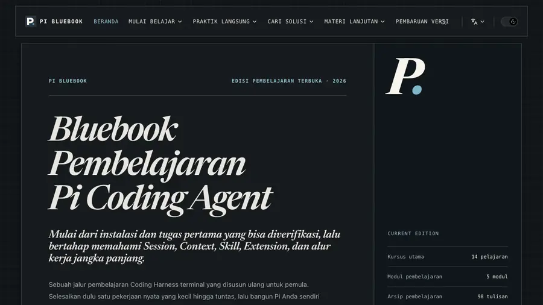
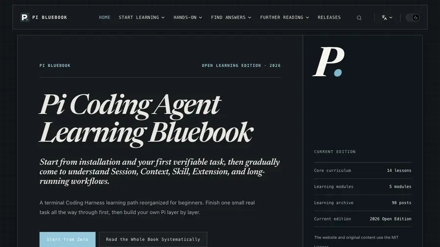

# Buku Pi | Jalur Belajar Pi Coding Agent (Bahasa Indonesia)

Buku panduan tidak resmi **Pi Coding Agent** (Coding Harness terminal yang minimalis) untuk pemula
berbahasa Indonesia. Mulai dari instalasi, login, dan tugas pertama yang bisa diverifikasi, lalu
bertahap menguasai Session, Context, Skill, Extension, Subagent, dan alur kerja agent jangka panjang.

Edisi ini adalah **terjemahan tidak resmi** dari proyek sumber
[pi-bluebook](https://github.com/xiaomoBoy/pi-bluebook)
(<https://pi.xiaomovps.com/>). Struktur halaman, desain, dan alur belajar dipertahankan; seluruh teks
diterjemahkan ke Bahasa Indonesia.

Situs ini **dua bahasa**: edisi Bahasa Indonesia di akar (`/`) dan edisi English di `/en/`.
Keduanya berbagi tema, komponen, dan struktur halaman yang sama; pengalih bahasa tersedia di navbar.



Edisi Bahasa Indonesia (di atas) dan edisi English di `/en/` (di bawah):



[Materi sumber (Bahasa Mandarin)](https://pi.xiaomovps.com) · [Mulai berpraktik](/guide/start-here) ·
[Baca sistematis](/guide/introduction) · [Laporkan masalah](https://github.com/xiaomoBoy/pi-bluebook/issues)

## Apa ini

- **Jalur belajar yang nyata**: tidak dimulai dari daftar fitur, tetapi dari menyelesaikan satu tugas
  kecil yang hasilnya bisa Anda periksa sendiri, lalu naik ke sesi, konteks, ekstensi, dan alur kerja
  jangka panjang.
- **Untuk pemula**: tersedia jalur macOS dan Windows (Git Bash); perintah, operasi di dalam Pi, dan
  teks tugas dijelaskan secara terpisah.
- **Menekankan verifikasi mandiri**: setiap pelajaran mengikuti alur “skenario → konsep → praktik →
  verifikasi”; klaim agent bahwa tugas “sudah selesai” tidak dianggap selesai.

## Isi situs

| Bagian | Isi |
| --- | --- |
| `/mulai` | Peta belajar: 5 modul, 14 pelajaran, estimasi waktu, dan tanda selesai tiap tahap |
| `/guide/` | Jalur utama Buku Pi: 5 modul, 14 pelajaran, dari instalasi sampai verifikasi keamanan |
| `/cases/` | 8 studi kasus praktik (CASE 01–08) dengan langkah dan daftar periksa |
| `/reference/` | Referensi cepat: FAQ, panduan penanganan masalah, glosarium, perbandingan Pi/OMP/Selesai |
| `/plugins/` | Rekomendasi plugin beserta cara memilih dan menilai risikonya |
| `/translations/` | Terjemahan berlisensi artikel Earendil |
| `/journey/`, `/tweets/` | Catatan penulis dan arsip 98 tweet |
| `/releases/` | Arsip versi Pi (data resmi, penjelajah interaktif) |
| `/about` | Tentang edisi ini dan pengelolanya |
| `/lisensi` | Status lisensi kode, teks edisi ini, dan materi pihak ketiga |

## Menjalankan secara lokal

Butuh Node.js 18+ (disarankan 20/22). Contoh dengan `npm`:

```bash
npm install
npm run docs:dev        # server pengembangan: http://localhost:5173
npm run docs:build      # build produksi ke docs/.vitepress/dist
npm run docs:preview    # pratinjau hasil build (vite preview)
npm run serve:dist      # pratinjau statis alternatif (tahan rebuild, port 4173)
```

`npm run serve:dist` memakai `scripts/serve-dist.mjs`: server statis kecil dengan dukungan
`cleanUrls` dan halaman 404, yang tidak crash ketika aset berubah hash karena rebuild.

### Catatan macOS

Bila `npm run docs:build` gagal dengan pesan `ERR_DLOPEN_FAILED` / “different Team IDs” pada
`rollup.darwin-arm64.node`, Node yang dipakai sedang berjalan dengan hardened runtime (mis. runtime
bawaan aplikasi). Pakai Node biasa, misalnya:

```bash
/opt/homebrew/bin/node node_modules/vitepress/bin/vitepress.js build docs
```

## Pemeriksaan mutu

```bash
npm run check:content     # semua tautan & aset lokal bisa diselesaikan
npm run check:releases    # data arsip versi masih konsisten
npm run check:consistency # label nav & prev/next cocok dengan judul halaman
npm run check:i18n        # paritas halaman ID↔EN, prefix /en, sisa kalimat Indonesia
npm run check             # konten + konsistensi + build + SEO + anchor + paritas i18n
```

`npm run check:pages` memeriksa ID heading yang benar-benar dirender di HTML hasil build, sehingga
tautan antar-halaman yang memakai anchor (mis. `/guide/connect-model#memilih-cara-akses-model`)
ikut terverifikasi, dan dijalankan juga uji regresi pencarian pada indeks hasil build — termasuk kueri
yang hanya cocok lewat padanan istilah (mis. `singgahan` menemukan halaman cache, `berkas` menemukan
halaman file).

Alamat yang salah diarahkan ke halaman 404 bergaya situs (`docs/404.md` + komponen `PiNotFound.vue`)
berisi tautan ke bagian utama, bukan halaman bawaan VitePress.

## Ilustrasi (Si Hitam)

Sepuluh gambar panduan digambar ulang menjadi ilustrasi gaya **Si Hitam** (line art hitam, latar putih,
satu aksen oranye) dengan label pendek di dalam gambar — tanpa aksara Mandarin sama sekali.

- Versi Indonesia: `docs/public/images/*.png`
- Versi English: `docs/public/en/images/*.png` (label English)
- Sumber & cadangan: `preview/illustrations/{id,en}/` dan `preview/originals/` (screenshot lama, untuk rollback)

**Semua aset raster situs disimpan sebagai WebP** (bukan PNG/JPEG) agar ringan — total turun dari 16,4 MB
menjadi ±2,2 MB. Hanya ikon/favicon dan kartu sosial (`favicon-48.png`, `icon-192.png`, `icon-512.png`,
`apple-touch-icon.png`, `og-image*.png`) yang tetap PNG karena platform sosial dan favicon
tidak seragam mendukung WebP. Konversi ulang:

```bash
python3 - <<'PY'
from PIL import Image
import os
for root, dirs, files in os.walk('docs/public/images'):
    for name in files:
        if not name.lower().endswith(('.png', '.jpg', '.jpeg')):
            continue
        src = os.path.join(root, name)
        dst = os.path.splitext(src)[0] + '.webp'
        Image.open(src).convert('RGBA').save(dst, 'WEBP', quality=82, method=6)
        os.remove(src)
PY
```

Pembuatannya memakai **Pi headless** dengan ekstensi imagegen Codex (bukan Codex CLI, karena token CLI-nya
 perlu login ulang):

```bash
pi -p -ne -e ~/.pi/agent/npm/node_modules/pi-codex-image-gen \
  'Use the codex_generate_image tool exactly once with this prompt: "<prompt English>". Then print the saved path.'
```

Prompt tiap gambar ada di `preview/illustrations/PROMPTS.md`. Setelah gambar dibuat, teks di dalamnya
diverifikasi dengan model vision (dibaca ulang lalu dibandingkan dengan label yang diminta) sebelum dipasang.

## Deploy

Situs diterbitkan lewat **Vercel** (repo ini terhubung ke project Vercel):

| Setelan | Nilai |
| --- | --- |
| Build command | `npm run check` (build + seluruh pemeriksaan mutu) |
| Output directory | `docs/.vitepress/dist` |
| Node | 22 |

Kalau output directory tidak diarahkan ke `docs/.vitepress/dist`, Vercel menerbitkan akar
repositori dan **semua URL menghasilkan 404**.

URL kanonik situs diambil dari env `PI_SITE_URL` (canonical, `og:url`, sitemap, hreflang). Nilai
bawaan di `docs/.vitepress/config.mts` sudah diisi domain yang sama, jadi build biasa pun benar.

Deploy manual dari terminal (perlu `vercel login` sekali saja, lalu `vercel link`):

```bash
npm run deploy          # produksi
npm run deploy:preview  # pratinjau draft
```

**Dua locale:** URL yang sama dipakai untuk canonical/hreflang kedua edisi (`/` untuk Indonesia,
`/en/` untuk English), jadi `PI_SITE_URL` berlaku untuk keduanya.

Perintah `curl` di dalam pelajaran mengunduh berkas contoh dari domain yang sama. Bila nanti
memakai domain sendiri, ubah env `PI_SITE_URL` di Vercel (atau bawaannya di
`docs/.vitepress/config.mts`, lalu:

```bash
grep -rl "pi.argakuka.com" docs \
  | xargs sed -i '' 's|pi.argakuka.com|domain-anda.com|g'
```
## Struktur proyek

```
docs/                      # akar situs VitePress — locale Indonesia
docs/en/                   # locale English (path relatif sama dengan edisi Indonesia)
  .vitepress/config.mts    # bahasa, tema, navigasi, SEO, hreflang
  .vitepress/config/       # navigasi & opsi pencarian
  .vitepress/theme/        # tema kustom + komponen
  .vitepress/data/         # data arsip versi (tetap dalam bahasa Inggris resmi)
  guide/ cases/ reference/ plugins/ translations/ journey/ tweets/ releases/
  public/                  # gambar, contoh berkas, favicon (bersama)
  public/en/               # aset khusus English: examples/ + images/diagrams/
  mulai.md lisensi.md 404.md  # peta belajar, lisensi, dan halaman 404 (berpasangan dengan docs/en/)
.translation/              # aturan & glosarium yang dipakai saat menerjemahkan
scripts/                   # pemeriksa konten, SEO, dan tautan
```

## Lisensi & atribusi

- Situs dan konten orisinal: **MIT License** (lihat `LICENSE`, `LICENSE-CONTENT.md`) —
  hak cipta dipegang oleh pemilik proyek sumber.
- Terjemahan berlisensi Earendil pada `/translations/`: **CC BY 4.0**; hak atas konten pihak ketiga
  tetap milik penulis aslinya.
- Edisi Bahasa Indonesia ini adalah karya turunan. Pertahankan atribusi di atas bila Anda
  mempublikasikan ulang.

Seluruh nama produk, merek, dan tangkapan layar milik pemiliknya masing-masing.
